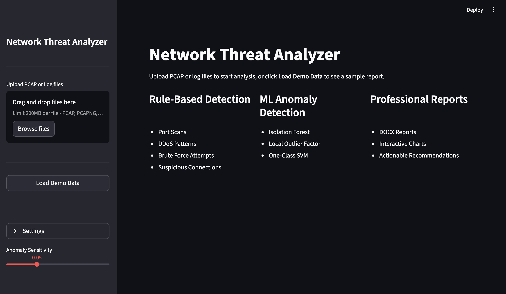
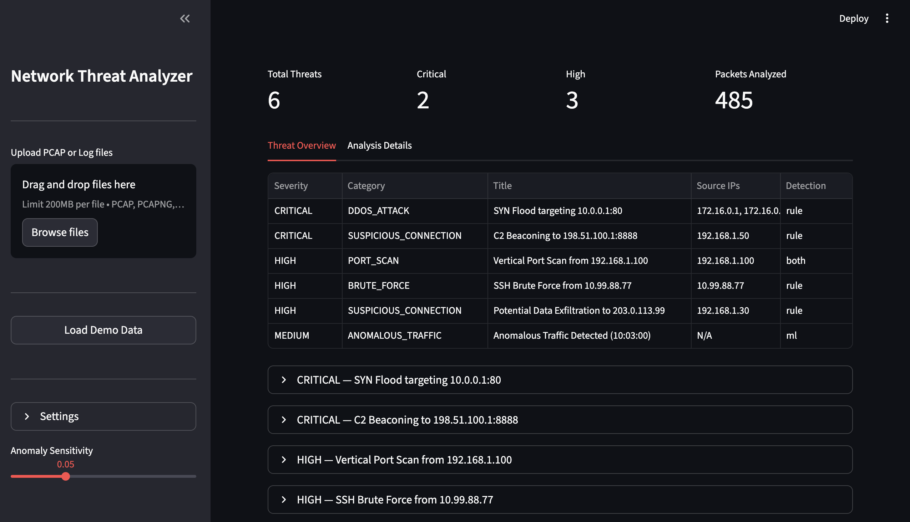

# Network Threat Analyzer

Multi-agent network threat detection system combining rule-based signature matching with ML anomaly detection to analyze PCAP files and server logs.


---

## Screenshots

**Start Screen** — upload PCAP/log files or load demo data; rule-based + ML detection


**Threat Analysis** — severity-ranked threat overview with rule and ML-based detections


---

## Architecture

```
PCAP / Log Files
      │
 ┌────┴────────┐
 ▼              ▼
PCAP Parser    Log Parser         Phase 1-2: Parse input files
(scapy)        (regex)
 └──────┬──────┘
        ▼
 Feature Extractor                Phase 3: 18 ML features per time window
 (pandas, numpy)
  ┌─────┴──────┐
  ▼            ▼
Rule Engine   Anomaly Detector    Phase 4-5: Dual detection
(signatures)  (ML ensemble)
  └─────┬──────┘
        ▼
 Threat Classifier                Phase 6: Merge, deduplicate, score 0-100
        ▼
 Report Generator                 Phase 7: DOCX report + charts
```

| Agent | Role | Technology |
|-------|------|-----------|
| **PCAP Parser** | Extracts packets, flows, and protocol statistics from capture files | scapy |
| **Log Parser** | Parses syslog and Apache/Nginx access logs with severity classification | regex |
| **Feature Extractor** | Computes 18 traffic features per time window for ML analysis | pandas, numpy |
| **Rule Engine** | Signature-based detection of known attack patterns | Custom rules |
| **Anomaly Detector** | Unsupervised ML ensemble for detecting unknown threats | scikit-learn |
| **Threat Classifier** | Merges detections, deduplicates, and assigns severity scores | Pydantic |
| **Report Generator** | Creates professional DOCX reports with embedded charts | python-docx, matplotlib |

> No API key required — all analysis runs locally using unsupervised machine learning.

---

## Detection Capabilities

### Rule-Based Detection

| Threat | Detection Method | Severity |
|--------|-----------------|----------|
| Vertical Port Scan | >20 ports scanned on single target in 60s | High |
| Horizontal Port Scan | Same port probed on >10 targets in 60s | High |
| SYN Scan | >80% SYN-only packets from single source | Medium |
| XMAS Scan | TCP packets with FIN+PSH+URG flags | High |
| SYN Flood | >100 SYN packets from >5 sources in 10s | Critical |
| UDP/ICMP Flood | Volume threshold exceeded for single target | Critical/High |
| SSH Brute Force | >5 failed logins from same IP in 60s | High |
| HTTP Brute Force | >10 POST requests to auth endpoints in 60s | High |
| C2 Beaconing | Regular-interval connections (std dev < 5s) | Critical |
| Data Exfiltration | >10MB outbound from internal to external IP | High |
| Malicious Ports | Traffic on known backdoor ports (4444, 1337, ...) | High |

### ML Anomaly Detection

| Algorithm | Strength | Weight |
|-----------|----------|--------|
| Isolation Forest | Global anomalies in high-dimensional data | 0.4 |
| Local Outlier Factor | Local density-based anomalies | 0.35 |
| One-Class SVM | Decision boundary for normal behavior | 0.25 |

Ensemble uses majority voting — a time window is flagged when 2+ models agree.

---

## Features

- **Dual Detection**: Rule-based signatures + unsupervised ML ensemble
- **PCAP Analysis**: Deep packet inspection (protocols, flags, payloads)
- **Multi-Format Log Parsing**: Syslog, Apache/Nginx access logs
- **18-Feature Extraction**: Entropy, ratios, rates, flow stats per time window
- **Severity Scoring**: 0-100 scale with automatic prioritization
- **Interactive Dashboard**: Streamlit interface with real-time analysis
- **Professional Reports**: DOCX output with embedded charts
- **Demo Mode**: Pre-built sample data for quick exploration

---

## Quickstart

```bash
# 1. Clone the repo
git clone https://github.com/eugen-goebel/network-threat-analyzer.git
cd network-threat-analyzer

# 2. Setup environment
python3 -m venv venv && source venv/bin/activate
pip install -r requirements.txt

# 3. Run demo analysis
python main.py --demo

# 4. Analyze your own files
python main.py capture.pcap server.log

# 5. Launch dashboard
streamlit run app.py
```

---

## Dashboard

The Streamlit dashboard provides:
- Real-time threat metrics (total, critical, high counts)
- Interactive threat table with severity filtering
- Protocol distribution charts
- Traffic timeline with anomaly highlighting
- DOCX report download

---

## Testing

```bash
pytest -v
```

54+ tests covering all agents, rules, ML pipeline, and report generation. No external dependencies required for testing.

---

## Sample Data

The included sample data contains intentional attack patterns:

| Pattern | Source | Details |
|---------|--------|---------|
| Port Scan | 192.168.1.100 | Sequential scan of ports 1-80 |
| SYN Flood | 172.16.0.x (15 IPs) | 80 SYN packets in 10 seconds |
| C2 Beaconing | 192.168.1.50 | 60-second interval to port 8888 |
| SSH Brute Force | 10.99.88.77 | 15 failed attempts + 1 success |
| Directory Traversal | 10.99.88.77 | ../../etc/passwd probes |
| Recon Scanning | 203.0.113.50 | /wp-admin, /.env, /.git probes |

Generate fresh sample data:
```bash
python data/generate_samples.py
```

---

## Project Structure

```
network-threat-analyzer/
├── main.py                    CLI entry point
├── app.py                     Streamlit dashboard
├── agents/
│   ├── orchestrator.py        7-phase pipeline coordinator
│   ├── pcap_parser.py         PCAP file parser (scapy)
│   ├── log_parser.py          Syslog/Apache log parser
│   ├── feature_extractor.py   ML feature computation
│   ├── rule_engine.py         Rule dispatch engine
│   ├── anomaly_detector.py    ML ensemble detector
│   ├── threat_classifier.py   Threat scoring and classification
│   └── mock_data.py           Demo mode data
├── models/
│   ├── network.py             Network data models
│   ├── threats.py             Threat detection models
│   └── reports.py             Report structure models
├── rules/
│   ├── port_scan.py           Port scan signatures
│   ├── ddos.py                DDoS pattern rules
│   ├── brute_force.py         Brute force detection
│   └── suspicious_connections.py  C2, exfiltration, malicious ports
├── utils/
│   ├── visualization.py       Chart generation
│   └── report_generator.py    DOCX report builder
├── data/
│   ├── generate_samples.py    Sample data generator
│   ├── sample_capture.pcap    Demo PCAP file
│   ├── sample_syslog.log      Demo syslog
│   └── sample_apache.log      Demo Apache log
└── tests/                     54+ tests
```

---

## Tech Stack

| Component | Technology |
|-----------|-----------|
| Packet Analysis | scapy |
| ML Detection | scikit-learn (Isolation Forest, LOF, One-Class SVM) |
| Feature Engineering | pandas, numpy |
| Dashboard | Streamlit |
| Reports | python-docx, matplotlib |
| Type Safety | Pydantic v2 |
| Testing | pytest |

---

## Report Sections

1. Executive Summary
2. Traffic Overview
3. Protocol Analysis
4. Threat Summary Table (color-coded severity)
5. Detailed Threat Analysis (evidence, IPs, recommendations)
6. Timeline Analysis
7. Recommendations (prioritized action items)
8. Methodology

---

## License

MIT
